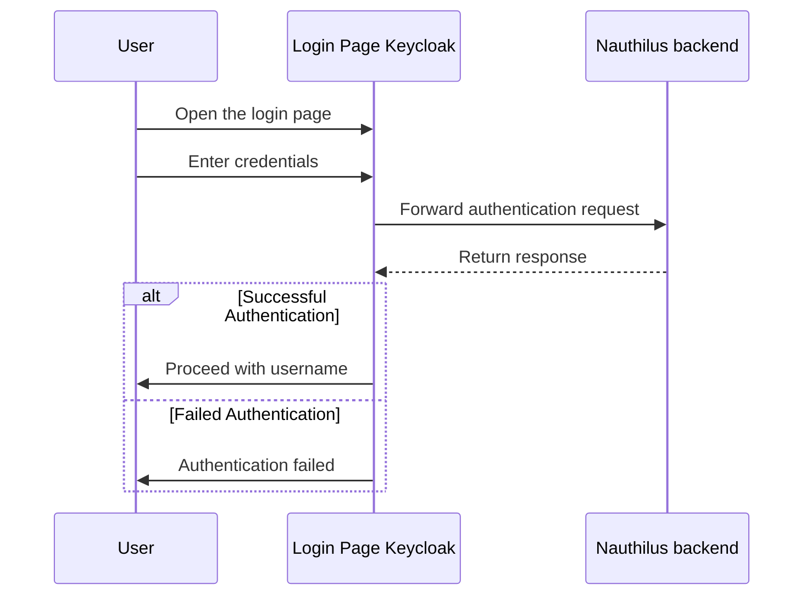

# Table of contents

<!-- TOC -->
* [Table of contents](#table-of-contents)
* [Nauthilus authenticator for keycloak](#nauthilus-authenticator-for-keycloak)
* [Authentication flow](#authentication-flow)
  * [Build](#build)
  * [Install and configure](#install-and-configure)
    * [Alternative 1 - Using environment variables](#alternative-1---using-environment-variables)
    * [Alternative 2 - Keycloak](#alternative-2---keycloak)
  * [Configure Nauthilus](#configure-nauthilus)
<!-- TOC -->

---

# Nauthilus authenticator for keycloak

This is a demo authenticator that replaces the default "username and password form" authenticator. It redirects
authentication attempts to Nauthilus. Upon a successful respone, an account name is returned to Keycloak, which must match an already known user on the system.

# Authentication flow


## Build

```shell
mvn clean package
```

---

## Install and configure

Copy the jar file into your keycloak environment and restart the service.

### Alternative 1 - Using environment variables

You must set at least two environment variables called NAUTHILUS_LOGIN_URL and NAUTHILUS_PROTOCOL,
which should look similar to these strings:

```
NAUTHILUS_LOGIN_URL=https://login.example.com/api/v1/auth/json
NAUTHILUS_PROTOCOL=keycloak
```

If your Nauthilus-server requires HTTP Basic authorization, please also add these variables:

```
NAUTHILUS_USERNAME
NAUTHILUS_PASSWORD
```

### Alternative 2 - Keycloak

You can configure the Nauthilus settings from within Keycloak. Press the setting wheel next to the Nauthilus step and add your values accordingly.

---

## Configure Nauthilus

You can find the "Nauthilus authenticator" in your flows. It replaces the default
"Username and password form" execution step.

For example, copy the browser flow and replace the authenticator with the Nauthilus version.

Nauthilus returns an account name. Keycloak must know about this user. Else the authentication step will fail.

Here is a simple yaml-blob for nauthilus.yml in a LDAP section:

```yml
ldap:

  config:
    
    server_uri: ldap://ldap.example.com:389/
    starttls: true

  search:

    - protocol: keycloak
      cache_name: keycloak
      base_dn: ou=people,dc=example,dc=com
      filter:
        user: |
          (&
            (objectClass=inetOrgPerson)
            (uniqueIdentifier=%L{user})
          )
      mapping:
        account_field: uniqueIdentifier
      attribute:
        - uniqueIdentifier
```

The configuration must match your settings in keycloak. I have configured a user federation with LDAP, where the settings match with the Nauthilus settings.
